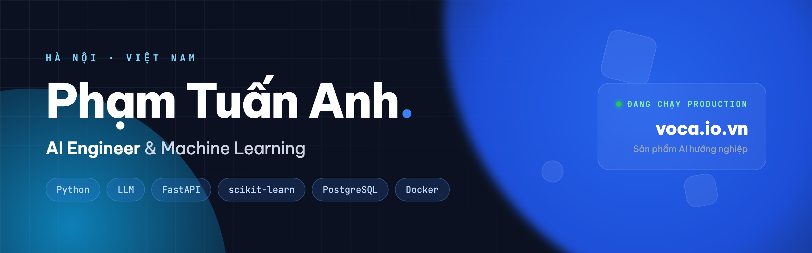
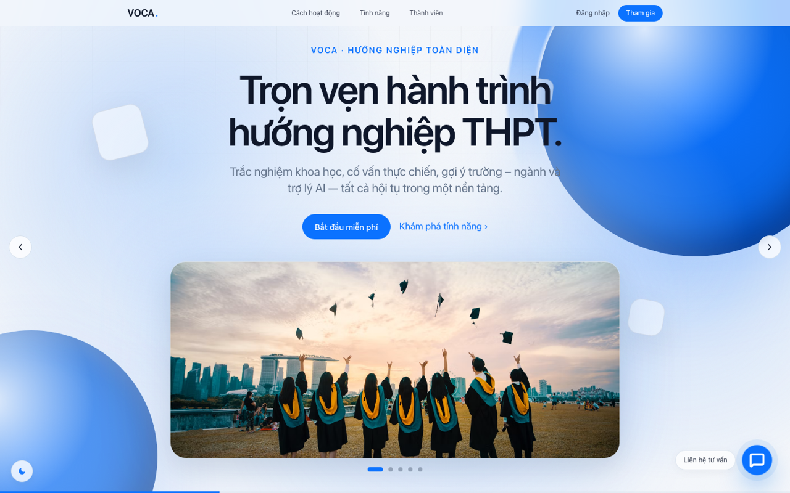
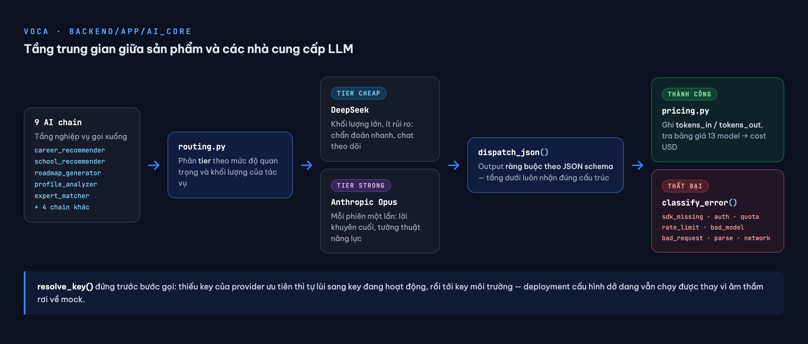
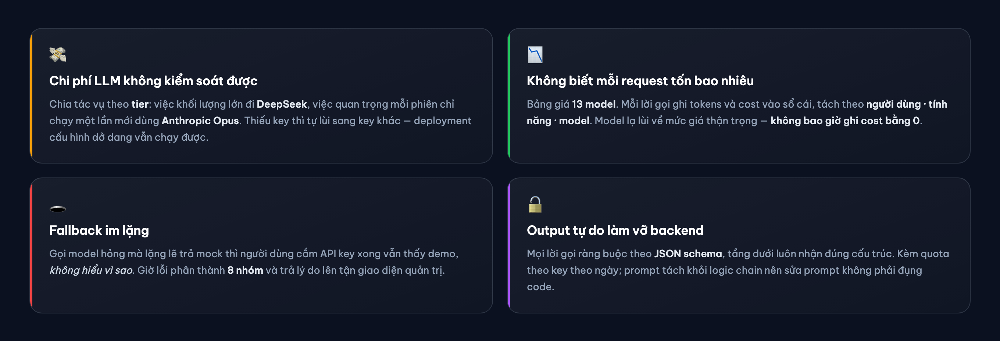
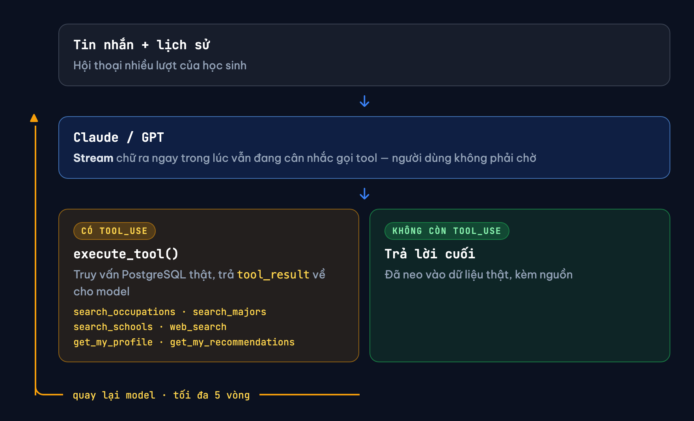
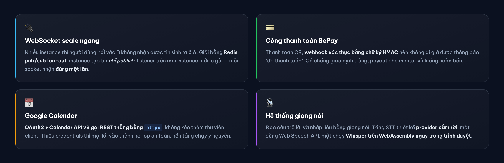
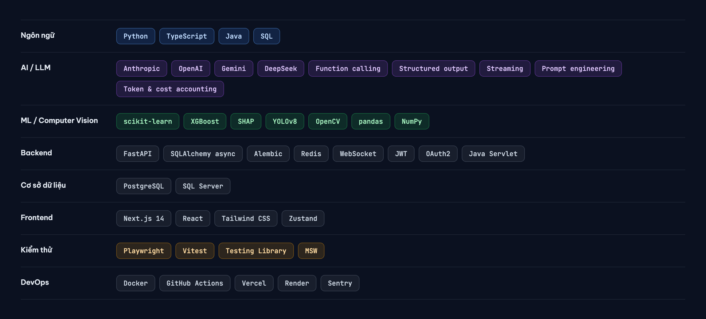

  

  

  

### Sinh viên năm cuối ngành Trí tuệ nhân tạo — Khoa học dữ liệu, Đại học FPT · 2022 – 2026

Tôi xây dựng và vận hành sản phẩm AI trên môi trường thật. Phần khó của AI trong sản phẩm không nằm 
ở lời gọi model, mà ở tầng bao quanh nó: định tuyến theo chi phí, ràng buộc định dạng đầu ra, 
xử lý khi nhà cung cấp gặp sự cố, và đo được chi phí của từng yêu cầu.

**Đang tìm vị trí thực tập hoặc toàn thời gian — có thể bắt đầu ngay**

---

## VOCA — nền tảng hướng nghiệp có AI

  

**[www.voca.io.vn](https://www.voca.io.vn)** · đang chạy production ·
**824 file · ~107.000 dòng code · 75 migration · 19 domain**

Sản phẩm gồm bốn nhóm tính năng: trắc nghiệm đánh giá năng lực, trợ lý AI hướng nghiệp, gợi ý trường
và ngành học, đặt lịch tư vấn với mentor. Hệ thống vận hành trên tên miền riêng, có tích hợp thanh toán,
điều khoản sử dụng và chính sách hoàn tiền. Tôi làm cả tầng AI, backend, frontend và hạ tầng.

> Mã nguồn để ở chế độ riêng tư do sản phẩm đang phục vụ người dùng. Tôi sẵn sàng cấp quyền truy cập
> để đánh giá trong quá trình phỏng vấn — vui lòng liên hệ qua email.

### Tầng `ai_core`

`ai_core` là tầng trung gian giữa sản phẩm và các nhà cung cấp LLM, do tôi tự thiết kế và xây dựng.

Bốn vấn đề chỉ lộ ra khi hệ thống chạy thật, và cách tôi xử lý:

Chín chain đang phục vụ người dùng: `career_recommender` · `school_recommender` · `roadmap_generator` ·
`profile_analyzer` · `expert_matcher` · `expert_review` · `consultation` · `advisor` · `base`

### AI Advisor — agent tự gọi tool

Chain `advisor` không chỉ sinh văn bản. Model tự xác định cần tra cứu dữ liệu nào, gọi tool tương ứng,
đọc kết quả trả về, rồi lặp lại cho tới khi đủ thông tin để trả lời.

- **Stream và tool use chạy đồng thời.** Nội dung được đẩy tới người dùng *ngay trong lúc* model vẫn đang cân nhắc gọi tool. Nếu đợi agent hoàn tất toàn bộ mới trả kết quả, người dùng phải chờ nhiều giây trước một màn hình trống.
- **Vòng lặp có trần cứng.** `MAX_TOOL_ITERS = 5`. Một vòng lặp không giới hạn có thể lặp vô hạn và tiêu hết ngân sách token.
- **Neo câu trả lời vào dữ liệu thật.** Sáu tool truy vấn trực tiếp PostgreSQL, kèm một tool tìm kiếm web **bắt buộc trích dẫn nguồn**. Đây là cơ chế ngăn model đưa ra tên ngành hoặc điểm chuẩn không có thật — rủi ro nghiêm trọng nhất của một sản phẩm tư vấn hướng nghiệp.

### Vài chỗ khó khác trong hệ thống

---

## Machine learning & computer vision

### Dự đoán khách hàng rời bỏ — explainable ML

10.000 hồ sơ khách hàng ngân hàng, churn rate 20,37%. HistGradientBoosting + `class_weight` →
**test PR-AUC 0,674 · ROC-AUC 0,846**. SHAP cho thấy Age > NumOfProducts > Geography.

- **Chọn ngưỡng theo mục tiêu nghiệp vụ, không lấy mặc định 0,5.** Chi phí của việc bỏ sót một khách hàng sắp rời bỏ cao hơn chi phí liên hệ nhầm một khách hàng vẫn đang ở lại. Tôi đặt ràng buộc recall ≥ 0,70, từ đó xác định ngưỡng 0,475 cho recall 0,690 và precision 0,513.
- **Chống rò rỉ dữ liệu.** Preprocessor chỉ `fit` trên train rồi mới `transform` cho val/test; pipeline 8 bước, stratified 70/15/15, `random_state=42`, chạy lại ra đúng số cũ.
- **Giữ lại kết quả âm tính.** SMOTE *không* cải thiện kết quả so với `class_weight` ở mức mất cân bằng này. Tôi giữ nguyên phát hiện đó trong báo cáo thay vì lược bỏ, vì biết một kỹ thuật không hiệu quả ở đâu cũng là một kết luận có giá trị.

### Nhận diện cảm xúc văn bản — NLP

Ứng dụng Flask phân tích cảm xúc của một câu tiếng Anh bằng **Watson NLP**, trả về điểm số cho năm cảm xúc
và xác định cảm xúc trội nhất. Có tầng xử lý cho đầu vào rỗng, trả về cấu trúc rỗng thay vì để lỗi lan xuống.
Năm unit test **giả lập lời gọi mạng** nên chạy được offline và cho kết quả tất định; pylint 10.00/10.

### Phát hiện cháy thời gian thực — computer vision

YOLOv8n trên camera IP, cảnh báo Telegram kèm ảnh có bounding box.

- **Cảnh báo theo chuyển trạng thái, không theo khung hình** — nếu gửi cảnh báo ở mỗi khung hình, một đám cháy kéo dài 10 giây sẽ sinh ra hàng trăm thông báo. Hệ thống chỉ gửi khi trạng thái chuyển từ `An toàn` sang `Nguy hiểm`, kèm khoảng chờ 20 giây giữa hai cảnh báo.
- **Ngưỡng `conf=0.7` đặt cao có chủ đích** — đánh đổi một phần recall để giảm đáng kể tỉ lệ báo động giả, vì đám cháy thật xuất hiện liên tục qua nhiều khung hình chứ không chỉ một. Quá trình inference chạy trên thread riêng nên giao diện không bị treo.

### Dự đoán giá nhà — regression

Kaggle *House Prices*, 80+ feature. Linear Regression làm baseline (CV RMSE ~36.000), so sánh Ridge, Lasso,
Random Forest và XGBoost; tuning bằng `GridSearchCV`.

---

## Backend Java — không dùng framework

Hệ thống đặt món trước và bán hàng tại quầy. Controller, DAO và view viết tay hết để nắm chắc MVC ba tầng.
Đơn đặt trước *không* xuống bếp ngay khi thanh toán — hệ thống giữ lại và chỉ đẩy xuống bếp **trước giờ hẹn
20 phút**, đủ để món vừa xong khi khách tới mà không bị nguội.

## Công nghệ

---

### Liên hệ

Thực tập sinh / Fresher — **AI Engineer · Machine Learning · Data Science**

Có thể bắt đầu ngay, nhận cả thực tập và toàn thời gian.

Hà Nội, Việt Nam

